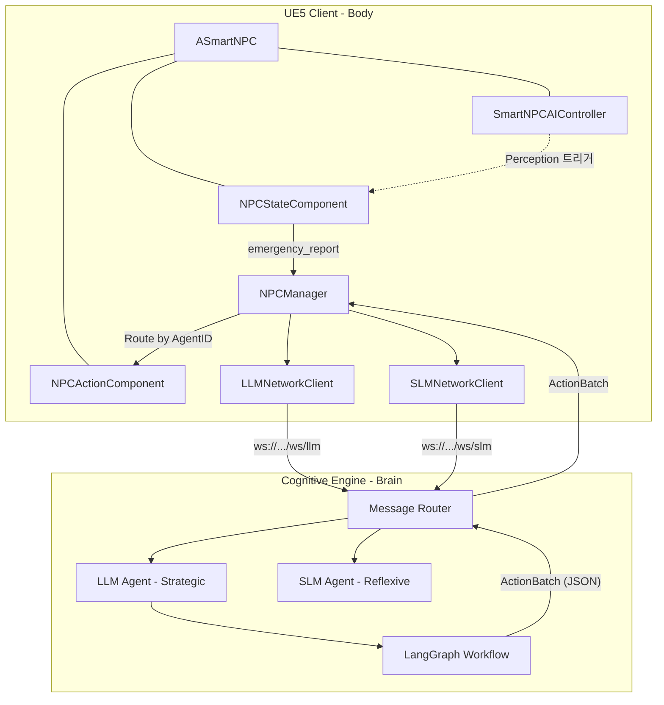
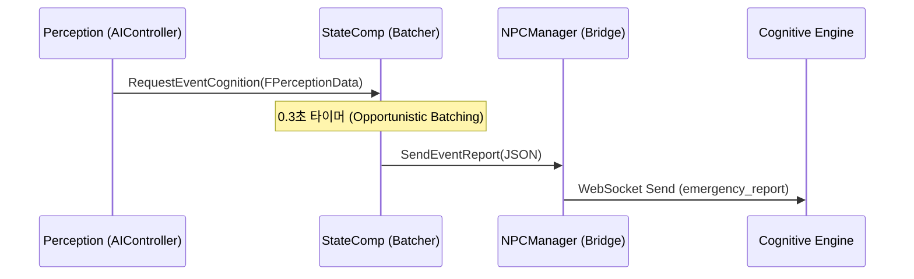
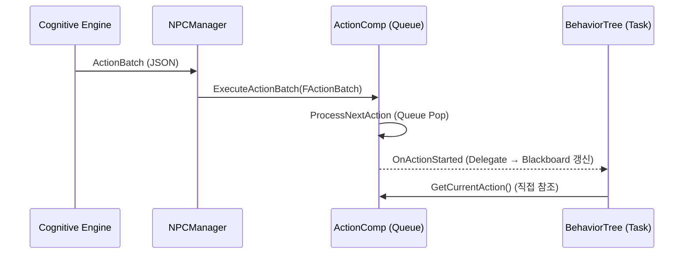

<!--
File: README.md
Purpose: Project Documentation.
OmniAgent VR System의 전체 아키텍처(Remote Cortex), 핵심 흐름, 데이터 규격, 사용법을 기술합니다.
-->

# OmniAgent VR System

> **한줄 요약**: 언리얼 엔진 5(UE5)의 VR 환경과 파이썬(Python) 기반 인지 엔진(Cognitive Engine)을 실시간 웹소켓(WebSocket)으로 연결하여, 지연을 최소화한 지능형 NPC 반응 시스템을 구축하는 **정책 기반 하이브리드 아키텍처(Policy-Driven Hybrid Architecture)**입니다.

---

## 📖 개요 (Overview)

이 프로젝트는 **Remote Cortex 패턴**을 구현합니다. 복잡한 추론과 상태 관리(State Management)는 파이썬 서버가 전담하고, 언리얼 엔진(UE5)은 렌더링과 몰입적인 VR 상호작용(Interaction)에만 집중합니다.

4개의 전문 에이전트(Agent)가 협업하여 생동감 있는 월드를 만들어냅니다:

| 에이전트         | 역할                                                    |
| :--------------- | :------------------------------------------------------ |
| **Supervisor**   | 전체 파이프라인 제어 및 에이전트 간 라우팅(Routing) 결정 |
| **Dialogue**     | NPC의 성격(Persona)과 기억(Memory)을 반영한 대화 생성    |
| **Rules**        | 게임 규칙 위반 여부 검증 및 수치 클램핑(Clamping)        |
| **Interface**    | UE5 ↔ 자연어 간 데이터 변환 (Input/Output 노드)         |

> 📚 **상세 기술 문서**
> - [NPC 아키텍처 (NPC.md)](docs/NPC.md)
> - [네트워크 통신 규격 (Connect.md)](docs/Connect.md)
> - [Python 인지 엔진 (Python.md)](docs/Python.md)

---

## 🏗 핵심 아키텍처 (Architecture)

### 시스템 토폴로지 (System Topology)



### 디렉토리 구조 (Directory Structure)

```
/OmniAgent_VR_System
├── 📂 CognitiveEngine               # Python 에이전트 서버 (FastAPI + LangGraph)
│   ├── 📂 app
│   │   ├── 📂 agents                # 에이전트 로직 (Supervisor, Dialogue, Rules, Interface)
│   │   │   └── 📂 subgraphs         # 하위 그래프 (Dialogue, Rules 노드)
│   │   ├── 📂 schemas               # 데이터 계약 (Pydantic V2 검증)
│   │   │   ├── 📄 actions.py         # ActionBatch, Clamp 로직
│   │   │   ├── 📄 game_state.py      # Vector3D, Entity 검증
│   │   │   └── 📄 vr_context.py      # GesPrompt (음성 + 제스처)
│   │   ├── 📂 utils                  # 유틸리티 (LLM Factory, 로깅)
│   │   └── 📄 main.py                # WebSocket 진입점 (Entry Point)
│   └── 📄 requirements.txt
│
├── 📂 Source (UE5 C++)               # 언리얼 엔진 소스
│   ├── 📂 NPC                        # NPC 시스템
│   │   ├── 📄 SmartNPC.h/cpp           # NPC 엔티티 (AgentID, Attributes, Tags)
│   │   ├── 📂 Action                   # 행동 시스템
│   │   │   ├── 📄 NPCActionComponent    # 행동 큐 및 실행기 (Action Queue & Executor)
│   │   │   └── 📄 SmartNPCAIController  # 인지 & 행동트리 드라이버
│   │   └── 📄 NPCStateComponent        # 상태 & 인지 배치 처리기
│   ├── 📂 Network                     # 네트워크 클라이언트 (WebSocket)
│   └── 📂 Core                        # 게임 상태 데이터
│
└── 📂 docs                           # 기술 문서
    ├── 📄 NPC.md
    ├── 📄 Connect.md
    └── 📄 Python.md
```

---

## 🔄 핵심 흐름: 4단계 파이프라인 (Core Flow)

전체 시스템은 다음 4단계를 순환하며 동작합니다.

### Step 1. 인지 및 수집 (Perception-Push)

NPC의 말초 감각(시각, 청각, 피격 등)이 취합되어 파이썬 서버로 전달되는 **저지연 보고 흐름**입니다.



- `SmartNPCAIController`가 시야/소리/피격을 감지하면 `NPCStateComponent`에 이벤트를 push합니다.
- `NPCStateComponent`는 0.3초 동안 이벤트를 일괄 취합(Batching)한 후, 단일 패킷(Single Packet)으로 서버에 전송합니다.

### Step 2. 채널 라우팅 (Channel Routing)

목적에 따라 **전략적 추론(LLM)**과 **반사적 대응(SLM)** 두 개의 통신 채널로 분기합니다.

| 채널       | 엔드포인트    | 용도                                   | 지연 허용 |
| :--------- | :------------ | :------------------------------------- | :-------- |
| **LLM**    | `/ws/llm`     | 장기 전략, 대화 생성, 복잡한 상황 판단 | 높음      |
| **SLM**    | `/ws/slm`     | 즉각적 감각 반응, 위협 감지, 도주/방어 | 500ms 이내 |

- SLM 채널은 LLM의 긴 추론 시간을 **우회(Bypass)**하여 즉각적인 행동 배치(ActionBatch)를 반환합니다.

### Step 3. 인지 엔진 추론 (Cognitive Reasoning)

파이썬 서버 내부의 **랭그래프(LangGraph) 파이프라인**이 수신된 데이터를 다중 에이전트 협업으로 처리합니다.

```
[수신] → Interface_Input (UE5 데이터 → 자연어 변환)
      → Supervisor (상황에 맞는 에이전트 선택/라우팅)
      → Dialogue / Action 에이전트 (추론 수행)
      → Interface_Output (자연어 결정 → ActionBatch 구조 변환)
      → Rules (게임 규칙 검증 & 수치 클램핑)
      → [송신]
```

- **숏컷(Shortcut)**: `has_error=True`이거나 대상 NPC가 없으면 LLM 호출 없이 즉시 종료하여 리소스를 절약합니다.
- **폴백(Fallback)**: 에이전트 응답 실패 시 Supervisor가 최소한의 리액션("..."; Confused)을 강제 생성하여 NPC의 멍 때림을 방지합니다.

### Step 4. 명령 실행 (Command-Pull)

인지 엔진의 결정이 UE5의 물리적 액션으로 변환·실행되는 흐름입니다.



- `NPCManager`가 응답의 `AgentID`를 기준으로 올바른 NPC에게 명령을 라우팅합니다.
- `NPCActionComponent`는 행동 대기열(Queue)에서 순차적으로 꺼내 실행하며, 델리게이트(Delegate)를 통해 블랙보드(Blackboard)와의 강결합(Tight Coupling)을 해소합니다.

---

## 📦 데이터 계약 (Data Contract)

### 통신 규격: Envelope System

모든 메시지는 추적과 보안을 위해 **Envelope**이라는 공통 래퍼(Wrapper)로 포장됩니다.

```json
{
    "msg_id": "GUID-String",
    "type": "state_update | prompt | emergency_report | action_failed",
    "timestamp": "ISO-8601-String",
    "auth_token": "Secret-Key",
    "ref_msg_id": "(Optional) Parent Message ID",
    "payload": { "/* 타입별 실제 데이터 */" }
}
```

### 핵심 데이터 구조체

| 구조체                | 핵심 필드                                          | 설명                          |
| :-------------------- | :------------------------------------------------- | :---------------------------- |
| **`FActionBatch`**    | `Mode`, `Actions[]`, `AgentID`                     | 서버에서 오는 단일 패킷 단위  |
| **`FGameAction`**     | `ActionType`, `FacialState`, `Parameters`          | Blackboard 우회 직접 참조     |
| **`FPerceptionData`** | `TargetID`, `SenseType`, `Location`, `DangerScore` | 시각/청각 인지 데이터         |
| **`FNPCAttributes`**  | `Resources(HP/MP)`, `Combat`, `Traits`             | NPC 정적/동적 상태 스냅샷     |

---

## 🚀 시작하기 (Getting Started)

### 사전 요구사항 (Prerequisites)

- **Python** 3.10+
- **Unreal Engine** 5.5+
- **Ollama** (로컬 SLM 추론용)
- 파이썬 패키지 설치: `pip install -r CognitiveEngine/requirements.txt`

### 인지 엔진 실행 (Running the Cognitive Engine)

```bash
cd OmniAgent_VR_System/CognitiveEngine
python -m uvicorn app.main:app --port 8000
```

서버가 기동되면 다음 엔드포인트가 활성화됩니다:
- `ws://localhost:8000/ws/llm` — 전략적 추론 (LLM)
- `ws://localhost:8000/ws/slm` — 반사적 대응 (SLM)

### 언리얼 엔진 설정 (Unreal Engine Setup)

1. UE5 프로젝트를 엽니다.
2. **WebSockets** 플러그인이 활성화되어 있는지 확인합니다.
3. `NPCManager`가 초기화 시 자동으로 LLM/SLM 웹소켓 클라이언트를 생성하고 서버에 연결합니다.
4. 서버 연결이 끊어지면, 행동 트리(Behavior Tree)의 `IsConnected` 블랙보드 키를 통해 자동으로 로컬 폴백(Fallback) 서브트리가 실행됩니다.

---

## ✨ 주요 기술적 특징 (Key Features)

### 1. 엄격한 데이터 검증 (Strict Data Contracts — Pydantic V2)

LLM의 환각(Hallucination)이 게임 엔진을 충돌시키는 것을 방지하기 위해, 모든 에이전트 결과물(Output)은 파이썬 측에서 엄격하게 검증됩니다.

- **클램핑(Clamping)**: 데미지 값이 100을 초과하면 자동으로 100으로 고정됩니다.
- **좌표 검증(Validation)**: `Vector3D` 좌표에 NaN/Inf 값이 들어오면 거부됩니다.

### 2. GesPrompt (멀티모달 인터페이스)

Interface 에이전트가 음성 전사(Transcription)와 VR 제스처 데이터를 융합하여, 지시 대명사(Deictic Reference)를 해소합니다.

- _플레이어가 말합니다_: "**이거** 열어." + _시선/포인팅_: `[Door_42]`
- _시스템이 해석합니다_: `Intent: Open(Target=Door_42)`

### 3. 듀얼 채널 최적화 (Dual-Channel Optimization)

- **LLM 채널**: 복잡한 대화와 전략 수립에 사용됩니다. 지연 시간이 길어도 괜찮습니다.
- **SLM 채널**: 즉각적인 위협 대응에 사용되며, 500ms 이내의 응답을 보장합니다.

### 4. 에러 회복력 (Error Resilience)

- **서버 단절 시**: UE5 행동 트리의 로컬 폴백 서브트리가 자동으로 NPC를 제어합니다.
- **추론 실패 시**: Supervisor가 최소한의 물리적 리액션을 강제 생성합니다.

---

## 🗺 로드맵 (Roadmap)

- [x] **Phase 1**: Foundation — 모노레포, 스키마, 기본 네트워크
- [x] **Phase 2**: Agent Logic — LangGraph 구현, Persona 로딩
- [/] **Phase 3**: Integration — UE5 행동 트리 연동, 인지 파이프라인
- [ ] **Phase 4**: Optimization — 스트리밍 응답, 지연 마스킹(Latency Masking)
