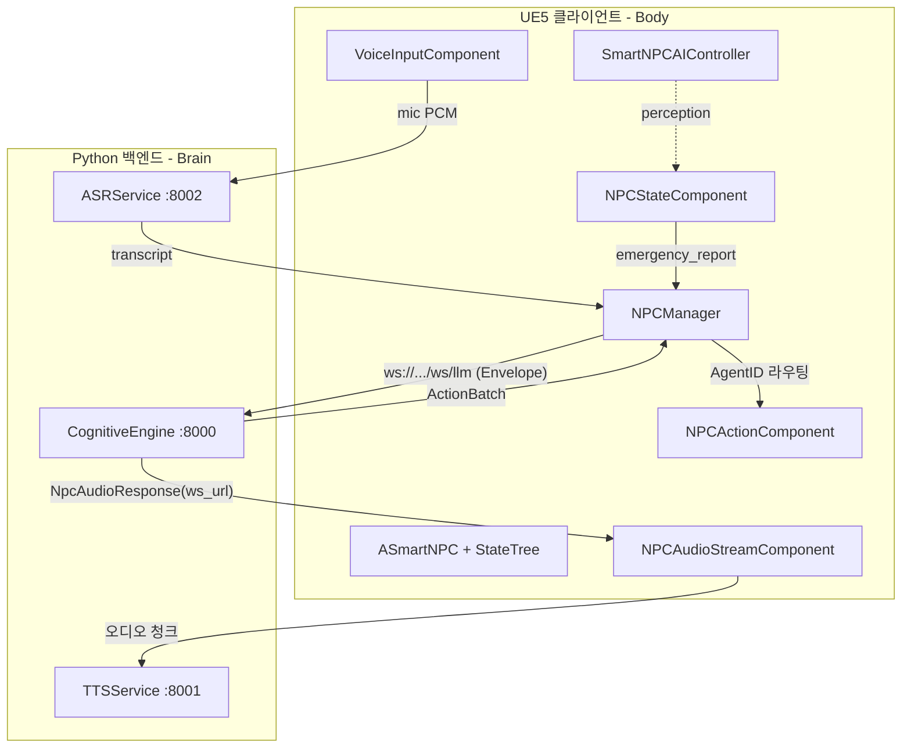

<!--
File: README.md
Purpose: 프로젝트 최상위 개요. 상세 문서는 docs/index.html, 세션 메모는 docs/Memo.md, 로드맵은 docs/ROADMAP.md.
-->

# OmniAgent VR System (UE5_MCP_VR)

> **한줄 요약**: 언리얼 엔진 5(UE5) VR 게임과 파이썬 인지 엔진을 WebSocket으로 연결해, LLM/SLM이 자율적으로 사고·행동하는 멀티 에이전트 NPC를 구동하는 **Remote Cortex 아키텍처**.

UE5는 렌더링·VR 상호작용·물리 실행만 전담하고, Python 서버가 전략 수립·대화 생성·음성 합성(TTS)·음성 인식(ASR)·기억 검색(RAG) 같은 연산 집약 추론을 전담한다.

---

## 구성 요소

| 프로세스 | 포트 | 역할 |
| :--- | :--- | :--- |
| **CognitiveEngine** | `:8000` | LangGraph 멀티 에이전트(대화·규칙·라우팅), SLM 반사, EQS 위치 결정, affinity/memory/RAG |
| **TTSService** | `:8001` | OpenVoice v2 + MeloTTS 감정 음색 합성 (zero-shot) |
| **ASRService** | `:8002` | faster-whisper large-v3 음성 인식 (push-to-talk) |
| **UE5 클라이언트** | — | SmartNPC(StateTree AI), VRPawn, 네트워크 레이어 |

각 서비스 상세 실행법은 해당 폴더 README 참조: [CognitiveEngine](OmniAgent_VR_System/CognitiveEngine/README.md) · [TTSService](OmniAgent_VR_System/TTSService/README.md) · [ASRService](OmniAgent_VR_System/ASRService/README.md).

---

## 아키텍처



> **단일 WebSocket 채널**: `ws://127.0.0.1:8000/ws/llm` 하나만 사용. `emergency_report`가 들어오면 Python이 Envelope 타입을 보고 내부에서 **SLM Reflex**(0.5초 반사 전투)와 **LLM 전략**으로 자동 라우팅한다. (구 `/ws/slm` 채널은 제거됨.)

---

## 데이터 흐름

1. **인지(Perception-Push)**: `SmartNPCAIController`가 시야/소리/피격 감지 → `NPCStateComponent`가 0.3초 디바운스 배치 → `emergency_report` 전송.
2. **음성 입력(ASR)**: push-to-talk → `VoiceInputComponent`가 PCM을 ASRService로 스트리밍 → transcript → `SendPlayerDialogue` → `prompt` 전송.
3. **추론(Cognitive)**: LangGraph 파이프라인 `interface_input → supervisor → dialogue → interface_output → rules`. persona·RAG·memory·affinity 반영.
4. **음성 출력(TTS)**: Dialogue 액션의 텍스트+FacialState → CognitiveEngine이 `NpcAudioResponse`(ws_url) 반환 → UE5가 TTSService에 직접 연결해 감정 음색 오디오 청크 수신.
5. **실행(Command-Pull)**: `ActionBatch`가 `AgentID`로 라우팅 → `NPCActionComponent` 큐 → StateTree(`STTask_PrepareNextAction` → `STTask_ExecuteSmartAction`)가 순차 실행.

---

## 통신 규격: MessageEnvelope

UE5 ↔ Python 모든 메시지는 공통 래퍼로 포장된다.

```json
{
  "msg_id": "uuid",
  "auth_token": "...",
  "timestamp": 1234567890.0,
  "type": "prompt | state_update | action_failed | emergency_report | location_decision",
  "payload": { "/* 타입별 데이터 */" }
}
```

| type | 방향 | 용도 |
| :--- | :--- | :--- |
| `state_update` | 양방향 | NPC 상태/호감도 동기화 |
| `prompt` | UE5→PY | 플레이어 발화(ASR)·제스처 명령 |
| `emergency_report` | UE5→PY | 위협 감지(0.3초 배치) → SLM Reflex |
| `location_decision` | UE5→PY | EQS 후보 중 전술 위치를 LLM에 문의 |
| `ModeActionRequest` | PY→UE5 | NPC 다음 행동 큐(ActionBatch) |

새 타입 추가 시 UE `EnvelopeBuilder` + Python `schemas/envelope.py`(`EEnvelopeType`) + `interface_input` 수신 분기를 **동시에** 수정해야 한다.

---

## 주요 기술 특징

- **StateTree AI**: BehaviorTree에서 마이그레이션 완료. `SmartNPCAIController`(ST schema) → `STTask_PrepareNextAction`(큐 Dequeue) → `STTask_ExecuteSmartAction`(실행). 비동기 액션 완료(이동 도착/몽타주 종료 콜백).
- **로컬 LLM/SLM**: Ollama 라우팅(normal `gemma4:e4b` / high `qwen3:8b` / core `gemma4-12b`). 클라우드 API 미사용.
- **감정 TTS**: LLM `[Facial: Angry]` → emotion → OpenVoice ToneColorConverter zero-shot 음색. 0.2s 백오프 1회 재시도, 실패 시 자막 폴백, `[trace=msg_id]` 로그 체인.
- **RAG 기억**: NPC별 FAISS 벡터스토어(로컬 `all-MiniLM-L6-v2`), `lore/persona/history` 카테고리. 지식 작성은 `knowledge_template/` 참조.
- **엄격한 검증**: Pydantic V2로 LLM 출력 클램핑(데미지 등)·좌표 NaN 거부.

---

## 시작하기

### 사전 요구사항
- Python 3.10+, Ollama(로컬 LLM), CUDA GPU(ASR/TTS large 모델), Unreal Engine 5.5+
- `pip install -r OmniAgent_VR_System/CognitiveEngine/requirements.txt`

### 서버 실행 (프로젝트 루트에서, 각각 별도 프로세스)
```powershell
python -m uvicorn OmniAgent_VR_System.CognitiveEngine.app.main:app --port 8000
python -m uvicorn OmniAgent_VR_System.TTSService.server:app --port 8001
python -m uvicorn OmniAgent_VR_System.ASRService.server:app --port 8002
```

### UE5
1. 프로젝트를 열고 **WebSockets** 플러그인 활성 확인.
2. `NPCManager`가 초기화 시 `ws://127.0.0.1:8000/ws/llm`에 자동 연결.
3. 디버그 대시보드: `http://127.0.0.1:8000/debug` (UE 없이 prompt→ActionBatch 확인).

---

## 문서

| 위치 | 내용 |
| :--- | :--- |
| `docs/index.html` | 통합 기술 문서(아키텍처·파이프라인·Envelope, Mermaid) — 브라우저로 열기 |
| `docs/ROADMAP.md` | 통합 로드맵(TTS/ASR/RAG/VR/멀티플레이) |
| `docs/Memo.md` | 세션 간 인수인계 메모(Todo/Done/Handoff) |
| `docs/주간기록/` | 주차별 개발 일지 |
| `CLAUDE.md` | 개발 규칙·컨벤션 |
