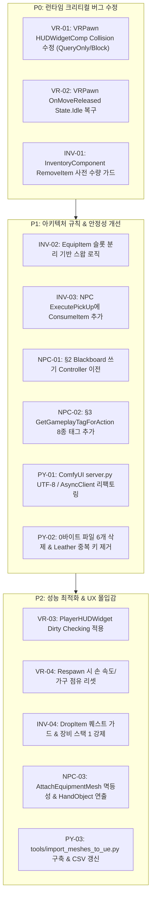

# 🛠️ [Code Review & Refactoring Report] feature/player-systems

> **브랜치:** `feature/player-systems` (기준: `Develop..HEAD`)  
> **작성 일자:** 2026-09-03  
> **검토 주체:** 4개 전문 AI 에이전트 연합 (VR Player Systems / Inventory Pipeline / NPC Action Architecture / Python Tools & MCP)  
> **목적:** 현재 브랜치에서 개발된 16개 커밋에 대한 무결성, 런타임 안정성, VR 성능, 아키텍처 규칙 준수 여부 정밀 감사 및 통합 리팩토링 가이드라인 제시

---

## 📑 목차

1. [Executive Summary (총평 및 이슈 요약)](#1-executive-summary)
2. [분야별 정밀 검토 및 리팩토링 가이드](#2-분야별-정밀-검토-및-리팩토링-가이드)
   - [Section 1. VR Player Core & Pawn Architecture](#section-1-vr-player-core--pawn-architecture)
   - [Section 2. Inventory & Item Pipeline](#section-2-inventory--item-pipeline)
   - [Section 3. NPC AI & Action Architecture (프로젝트 전역 규칙)](#section-3-npc-ai--action-architecture)
   - [Section 4. Python Backend & ComfyUI MCP / Data Tools](#section-4-python-backend--comfyui-mcp--data-tools)
3. [우선순위별 리팩토링 체크리스트 (Action Plan)](#3-우선순위별-리팩토링-체크리스트)
4. [결론 및 차기 마일스톤 제언](#4-결론-및-차기-마일스톤-제언)

---

## 1. Executive Summary

현재 브랜치(`feature/player-systems`)는 **VR 플레이어 단일 폰(`AVRPawn`) 체제 정립**, **72종 아이템 마스터 레지스트리 및 2D/3D 파이프라인 완결**, **동역학 기반 데미지 모델**, **인벤토리 수량 조회/스택 상한 API 구축** 등 핵심 마일스톤을 훌륭하게 달성했습니다.

그러나 4개 전문 에이전트의 교차 정밀 코드 감사 결과, **VR 런타임 기능 마비 및 데이터 무결성을 훼손할 수 있는 심각한 버그(Critical/High) 7건**과 프로젝트 전역 아키텍처 규칙 위반 2건이 식별되었습니다.

### 📊 이슈 요약 대시보드

| 검토 영역 | 검토 파일 | 핵심 이슈 | 심각도 |
| :--- | :--- | :--- | :---: |
| **VR Player Core** | `VRPawn.cpp/.h`<br>`PlayerHUDWidget.cpp` | • 3D HUD 위젯 콜리전 `NoCollision`으로 UI 클릭/호버 불능<br>• 이동 정지 시 State Tag(`TAG_State_Action_Common_Move`) 영구 누수<br>• `NativeTick` 매 프레임 거대 구조체 복사 4회 및 Slate 텍스트 셰이핑 폭주<br>• 리스폰 시 손 속도 미초기화로 순간이동 첫 프레임 허위 강타 발동 | **Critical / High** |
| **Inventory & Item** | `InventoryComponent.cpp`<br>`DroppedItemBase.h`<br>`ItemManager.cpp` | • `RemoveItem` 부분 차감 실패 시 아이템 영구 증발 버그<br>• 인벤토리 가득 찬 상태(10/10)에서 장비 교체(Swap) 불가 버그<br>• NPC `ExecutePickUp` 시 월드 액터 미소멸로 인한 무한 복제 취약점<br>• 퀘스트 아이템(`EItemType::Quest`) 드랍 방어 누락 | **Critical / High** |
| **NPC Action** | `NPCActionComponent.cpp`<br>`SmartNPCAIController.cpp` | • **§2 위반:** `UpdateEQSParams`에서 Blackboard 직접 쓰기 수행<br>• **§3 불일치:** `GetGameplayTagForAction` 태그 8종 누락<br>• `AttachEquipmentMesh` 중복 부착 시 이전 컴포넌트 누수(멱등성 결여)<br>• `ExecuteTrade` 일방적 아이템 무상 증여 취약점 | **High / Medium** |
| **Python & Tools** | `tools/comfyui_mcp/server.py`<br>`batch_generate_*.py`<br>`ItemRegistry.csv` | • FastMCP stdio 인코딩 미설정 및 비동기 루프 내 동기 I/O 블로킹<br>• 0바이트 빈 파일 6개 방치 및 `batch_generate_icons.py` 키 중복 정의<br>• 3D/2D 렌더링/전처리 스크립트 중복 복제 파편화<br>• `ItemRegistry.csv`의 `WorldMesh` 컬럼 전량 공란 | **High / Medium** |

---

## 2. 분야별 정밀 검토 및 리팩토링 가이드

---

### Section 1. VR Player Core & Pawn Architecture

#### [VR-01] [Critical / Bug] 3D HUD 위젯 콜리전 NoCollision으로 인한 UI 클릭/호버 먹통
- **위치:** `Source/UE5_MCP_VR/Core/VRPawn.cpp:117`
- **현상 및 리스크:**
  `VRPawn` 생성자에서 `HUDWidgetComp->SetCollisionEnabled(ECollisionEnabled::NoCollision);`로 설정되어 있습니다. `HUDInteractor`(`UWidgetInteractionComponent`)는 `EWidgetInteractionSource::World` 모드에서 물리 레이트레이스(`ECC_Visibility`)를 발사하여 위젯을 감지합니다. 콜리전이 꺼져 있으면 레이트레이스가 위젯을 완전히 관통하여, 오른손 트리거를 눌러도 슬레이트 위젯에 마우스 클릭/호버 이벤트가 일절 전달되지 않아 인벤토리 UI 조작이 불가능합니다.
- **리팩토링 코드:**
```cpp
// Source/UE5_MCP_VR/Core/VRPawn.cpp (생성자)
HUDWidgetComp = CreateDefaultSubobject<UWidgetComponent>(TEXT("HUDWidgetComp"));
HUDWidgetComp->SetupAttachment(MotionControllerLeft);
HUDWidgetComp->SetRelativeLocation(HUDPanelLocation);
HUDWidgetComp->SetDrawSize(HUDPanelDrawSize);
HUDWidgetComp->SetRelativeScale3D(FVector(HUDPanelScale));
HUDWidgetComp->SetTwoSided(true);

// [수정] 이동/물리에는 영향 없되(QueryOnly), Visibility 채널만 Block 하여 레이 감지 허용
HUDWidgetComp->SetCollisionEnabled(ECollisionEnabled::QueryOnly);
HUDWidgetComp->SetCollisionResponseToAllChannels(ECR_Ignore);
HUDWidgetComp->SetCollisionResponseToChannel(ECC_Visibility, ECR_Block);
HUDWidgetComp->SetVisibility(false);
```

---

#### [VR-02] [Critical / Bug] 이동 정지 시 Move 태그 미회수 및 Idle 태그 미복구
- **위치:** `Source/UE5_MCP_VR/Core/VRPawn.cpp:498-533`
- **현상 및 리스크:**
  `OnMove`는 스틱 입력 시 `TAG_State_Action_Common_Move`를 부여하지만, 스틱을 놓았을 때 호출되는 `OnMoveReleased` 및 `Input.IsNearlyZero()` 조기 반환 지점에서 Move 태그 회수와 `TAG_State_Idle` 복구가 누락되었습니다. 플레이어가 게임 시작 후 한 번이라도 이동하면 영구히 Move 태그 상태로 남아 AI 인지, StateTree 조건 분기, 애니메이션 상태 머신과 심각한 불일치를 일으킵니다.
- **리팩토링 코드:**
```cpp
// Source/UE5_MCP_VR/Core/VRPawn.cpp
void AVRPawn::OnMove(const FInputActionValue& Value)
{
    if (SeatedFurniture.IsValid())
    {
        SetSprinting(false);
        return;
    }

    FVector2D Input = Value.Get<FVector2D>();
    if (Input.IsNearlyZero())
    {
        SetSprinting(false);
        RemoveStateTag(TAG_State_Action_Common_Move);
        AddStateTag(TAG_State_Idle);
        return;
    }

    SetSprinting(Input.Size() > SprintThreshold);

    if (!VRCamera) return; // 널 가드

    const FRotator CameraYaw(0.f, VRCamera->GetComponentRotation().Yaw, 0.f);
    const FVector Forward = FRotationMatrix(CameraYaw).GetUnitAxis(EAxis::X);
    const FVector Right   = FRotationMatrix(CameraYaw).GetUnitAxis(EAxis::Y);

    AddMovementInput(Forward, Input.Y);
    AddMovementInput(Right,   Input.X);

    RemoveStateTag(TAG_State_Idle);
    AddStateTag(TAG_State_Action_Common_Move);
}

void AVRPawn::OnMoveReleased(const FInputActionValue& /*Value*/)
{
    SetSprinting(false);
    RemoveStateTag(TAG_State_Action_Common_Move);
    AddStateTag(TAG_State_Idle);
}
```

---

#### [VR-03] [Major / VR Perf] PlayerHUDWidget의 매 틱 거대 구조체 복사 및 Slate Invalidation 폭주
- **위치:** `Source/UE5_MCP_VR/UI/PlayerHUDWidget.cpp:27-59, 65-89`
- **현상 및 리스크:**
  `NativeTick`에서 `GetHealthPercent()`, `GetCurrentHealth()`, `GetMaxHealth()`를 매 프레임 호출하며 거대 구조체 `FPlayerAttributes` 복사가 틱당 4회 발생합니다. 또한 HP 변화가 없음에도 매 프레임 `HealthText->SetText(...)`를 호출하여 동적 힙 메모리 할당과 Slate Text Shaping Invalidation(글꼴 렌더 버텍스 재계산)이 발생해 VR 90Hz 환경에서 극심한 프레임 드랍을 유발합니다.
- **리팩토링 코드:**
```cpp
// Source/UE5_MCP_VR/UI/PlayerHUDWidget.h 에 캐시 변수 추가
protected:
    float CachedHealth = -1.f;
    float CachedMaxHealth = -1.f;

// Source/UE5_MCP_VR/UI/PlayerHUDWidget.cpp
void UPlayerHUDWidget::NativeTick(const FGeometry& MyGeometry, float InDeltaTime)
{
    Super::NativeTick(MyGeometry, InDeltaTime);

    APawn* CurrentPawn = GetOwningPlayerPawn();
    if (CurrentPawn && CurrentPawn != OwnerPawn)
    {
        if (IsValid(OwnerPawn))
        {
            if (UInventoryComponent* OldInv = OwnerPawn->FindComponentByClass<UInventoryComponent>())
            {
                OldInv->OnInventoryChanged.RemoveDynamic(this, &UPlayerHUDWidget::RequestInventoryRefresh);
            }
        }
        OwnerPawn = CurrentPawn;
        bInventoryDelegateBound = false;
        TryBindInventoryDelegate();
        CachedHealth = -1.f; // 폰 교체 시 강제 갱신
    }

    // [최적화] 속성 조회 1회 + Dirty Checking 적용
    if (IsValid(OwnerPawn) && OwnerPawn->Implements<UPlayerBase>())
    {
        const FPlayerAttributes Attr = IPlayerBase::Execute_GetPlayerAttributes(OwnerPawn);
        const float CurrentHP = Attr.Resources.Health;
        const float MaxHP     = Attr.Resources.MaxHealth;

        if (!FMath::IsNearlyEqual(CurrentHP, CachedHealth, 0.1f) || !FMath::IsNearlyEqual(MaxHP, CachedMaxHealth, 0.1f))
        {
            CachedHealth = CurrentHP;
            CachedMaxHealth = MaxHP;

            const float Percent = (MaxHP > KINDA_SMALL_NUMBER) ? FMath::Clamp(CurrentHP / MaxHP, 0.f, 1.f) : 0.f;
            if (HealthBar) HealthBar->SetPercent(Percent);
            if (HealthText) HealthText->SetText(FText::FromString(FString::Printf(TEXT("%.0f / %.0f"), CurrentHP, MaxHP)));
        }
    }
}
```

---

#### [VR-04] [Major / Safety] 사망 및 리스폰 시 손 속도, 착석 가구, UI 리셋 누락
- **위치:** `Source/UE5_MCP_VR/Core/VRPawn.cpp:1119-1130`
- **현상 및 리스크:**
  1. `Respawn()` 순간이동 시 `bHandVelInit`이 `true`로 남아있으면 직전 손 위치와 리스폰 위치 간의 거대한 위치 델타(수십 m/s)로 인해 첫 프레임에 `TryMeleeHits`가 폭발하여 주변 NPC를 즉사시키는 허위 공격 버그 발생.
  2. 의자에 앉은 채 사망 시 가구가 영구 점유 상태로 남아 다른 NPC/플레이어가 이용 불가.
- **리팩토링 코드:**
```cpp
void AVRPawn::HandleDeath()
{
    if (SeatedFurniture.IsValid())
    {
        StandUpFromFurniture();
    }

    if (bInventoryOpen)
    {
        bInventoryOpen = false;
        ApplyInventoryPresentation(false);
    }
    SetSprinting(false);
    TurnAxisInput = 0.f;

    PawnDeathUtils::HandleDeath(this, GameplayTags,
        RespawnDelay, RespawnTimerHandle,
        FTimerDelegate::CreateUObject(this, &AVRPawn::Respawn), TEXT("VRPawn"));
}

void AVRPawn::Respawn()
{
    PawnDeathUtils::Respawn(this, CurrentStats, bHasCheckpoint, CheckpointLocation,
        CheckpointRotation, CheckpointHP, GameplayTags, TEXT("VRPawn"));

    // 텔레포트 직후 허위 손 속도로 인한 근접 공격 오발 원천 차단
    bHandVelInit = false;
    HandVelLeft = FVector::ZeroVector;
    HandVelRight = FVector::ZeroVector;
}
```

---

### Section 2. Inventory & Item Pipeline

#### [INV-01] [Critical / Bug] RemoveItem 원자성(All-or-Nothing) 결여로 인한 아이템 영구 증발
- **위치:** `Source/UE5_MCP_VR/Inventory/InventoryComponent.cpp:152-197`
- **현상 및 리스크:**
  `AddItem`은 스냅샷 복구로 원자성을 완벽히 보장하지만, `RemoveItem`은 사전 검증 없이 슬롯을 순회하며 차감합니다. 요청 수량(`Amount`)보다 부족한 수량만 슬롯에 있을 경우, 슬롯에 있던 아이템을 전부 삭제한 후 `RemainingToRemove > 0`이 되어 최종적으로 `false`를 반환합니다. 상위 호출부(거래, 제작 등)는 실패로 인지하고 취소하지만 인벤토리 내 아이템은 이미 일부 차감되어 **영구 증발**합니다.
- **리팩토링 코드:**
```cpp
bool UInventoryComponent::RemoveItem(const FString& ItemID, int32 Amount)
{
    if (Amount <= 0) return false;

    // [원자성 보장] 슬롯 내 총 보유량이 요청량보다 적으면 슬롯을 전혀 건드리지 않고 즉시 실패 반환
    if (GetItemCountInSlots(ItemID) < Amount)
    {
        UE_LOG(LogTemp, Warning, TEXT("[Inventory] RemoveItem 실패: %s 수량 부족 (보유: %d, 요청: %d)"),
               *ItemID, GetItemCountInSlots(ItemID), Amount);
        return false;
    }

    int32 RemainingToRemove = Amount;
    float WeightRemoved = 0.0f;

    for (int32 i = 0; i < InventorySlots.Num(); i++)
    {
        if (InventorySlots[i].IsEmpty()) continue;
        
        if (InventorySlots[i].ItemData.ItemID == ItemID)
        {
            int32 AmountToRemove = FMath::Min(RemainingToRemove, InventorySlots[i].Count);
            InventorySlots[i].Count -= AmountToRemove;
            RemainingToRemove -= AmountToRemove;
            
            WeightRemoved += (InventorySlots[i].ItemData.Weight * static_cast<float>(AmountToRemove));

            if (InventorySlots[i].Count <= 0)
            {
                InventorySlots[i].ItemData = FItemData();
                InventorySlots[i].Count = 0;
            }

            if (RemainingToRemove <= 0) break;
        }
    }

    CurrentWeight = FMath::Max(0.0f, CurrentWeight - WeightRemoved);
    OnInventoryChanged.Broadcast();
    return true;
}
```

---

#### [INV-02] [High / Bug] 인벤토리 가득 찬 상태(10/10)에서 장비 교체(Swap) 불가 버그
- **위치:** `Source/UE5_MCP_VR/Inventory/InventoryComponent.cpp:525-580` (`EquipItem`)
- **현상 및 리스크:**
  `EquipItem`은 기존 장착 부위에 템이 있으면 `UnequipItem`을 먼저 호출합니다. 하지만 슬롯이 10개 모두 차 있는 상태에서 인벤토리의 무기를 장착하려 하면, 장착하려는 무기가 인벤토리 슬롯에서 빠져나가기 전에 기존 장착품을 `AddItem`하려고 시도하므로 **"슬롯 부족"으로 `UnequipItem`이 실패하고 전체 장착이 취소**됩니다.
- **리팩토링 코드:**
```cpp
bool UInventoryComponent::EquipItem(const FString& ItemID, EEquipmentSlot TargetSlot)
{
    int32 SlotIndex = GetSlotIndexByItemID(ItemID);
    if (SlotIndex == INDEX_NONE) return false;

    FInventorySlot& TargetInvSlot = InventorySlots[SlotIndex];
    FItemData ItemToEquip = TargetInvSlot.ItemData;
    if (ItemToEquip.ItemType != EItemType::Equipment) return false;

    if (TargetSlot == EEquipmentSlot::None) TargetSlot = ItemToEquip.EquipSlot;
    if (TargetSlot == EEquipmentSlot::None) return false;

    // [스왑 공간 확보] 장착할 슬롯에서 아이템을 먼저 분리하여 1슬롯 확보
    if (TargetInvSlot.Count > 1)
    {
        TargetInvSlot.Count--;
    }
    else
    {
        InventorySlots[SlotIndex] = FInventorySlot();
    }

    // 기존 장비가 있다면 확보된 슬롯으로 안전하게 반환
    if (EquipmentSlots.Contains(TargetSlot))
    {
        FInventorySlot OldEquipped = EquipmentSlots[TargetSlot];
        EquipmentSlots.Remove(TargetSlot);
        DetachEquipmentMesh(TargetSlot);
        CurrentWeight -= (OldEquipped.ItemData.Weight * static_cast<float>(OldEquipped.Count));

        if (!AddItem(OldEquipped.ItemData, OldEquipped.Count, false))
        {
            // 롤백 방어
            InventorySlots[SlotIndex].ItemData = ItemToEquip;
            InventorySlots[SlotIndex].Count = 1;
            EquipmentSlots.Add(TargetSlot, OldEquipped);
            AttachEquipmentMesh(TargetSlot, OldEquipped.ItemData);
            return false;
        }
    }

    // 새 장비 등록
    FInventorySlot NewEquipSlot;
    NewEquipSlot.ItemData = ItemToEquip;
    NewEquipSlot.Count = 1;
    EquipmentSlots.Add(TargetSlot, NewEquipSlot);
    AttachEquipmentMesh(TargetSlot, NewEquipSlot.ItemData);

    OnInventoryChanged.Broadcast();
    return true;
}
```

---

#### [INV-03] [High / Bug] NPC ExecutePickUp 시 월드 액터 미소멸로 인한 무한 복제
- **위치:** `Source/UE5_MCP_VR/NPC/Action/NPCActionComponent.cpp:2215-2234`
- **현상 및 리스크:**
  `VRPawn::TryPickupNearby`는 아이템 추가 성공 시 `Nearest->ConsumeItem()`을 정상 호출하여 월드 액터를 소멸시킵니다. 하지만 `UNPCActionComponent::ExecutePickUp`은 `AddItem`만 호출하고 월드 상의 `ADroppedItemBase` 액터를 소멸시키지 않아 **아이템이 무한 복제**됩니다.
- **리팩토링 코드:**
```cpp
void UNPCActionComponent::ExecutePickUp(FVector Location)
{
    BaseMove(Location, EMoveType::Walk);
    BasePlayActionMedia(TEXT("PickUp"));

    UGameInstance* GI = GetWorld() ? GetWorld()->GetGameInstance() : nullptr;
    UItemManager* ItemManager = GI ? GI->GetSubsystem<UItemManager>() : nullptr;
    if (!ItemManager || !InventoryComponent) return;

    ACharacter* OwnerCharacter = Cast<ACharacter>(GetOwner());
    if (!OwnerCharacter) return;

    const TArray<FDroppedItemData> NearbyItems = ItemManager->GetItemsInRange(OwnerCharacter->GetActorLocation(), 120.f);
    for (const FDroppedItemData& DroppedData : NearbyItems)
    {
        ADroppedItemBase* DroppedActor = Cast<ADroppedItemBase>(DroppedData.ItemActor);
        if (!IsValid(DroppedActor)) continue;

        FItemData MasterData;
        if (!ItemManager->GetItemDataByID(DroppedActor->ItemData.ItemTemplateID, MasterData)) continue;

        if (InventoryComponent->AddItem(MasterData, DroppedActor->Amount))
        {
            UE_LOG(LogTemp, Log, TEXT("[NPCAction] 줍기 성공: %s x%d"), *MasterData.ItemID, DroppedActor->Amount);
            // [중요] 획득 성공 시 월드 액터 소멸 및 ItemManager 등록 풀에서 해제
            DroppedActor->ConsumeItem();
        }
    }
}
```

---

#### [INV-04] [Medium / Safety] 퀘스트 아이템 DropItem 방어 및 내구도 아이템 스택 1 강제
- **위치:** `Source/UE5_MCP_VR/Inventory/InventoryComponent.cpp:201, 317`
- **리팩토링 코드:**
```cpp
// 1. DropItem 퀘스트 가드
bool UInventoryComponent::DropItem(const FString& ItemID, int32 Amount)
{
    if (Amount <= 0) return false;
    const int32 SlotIndex = GetSlotIndexByItemID(ItemID);
    if (SlotIndex == INDEX_NONE || GetItemCountInSlots(ItemID) < Amount) return false;

    const FItemData Data = InventorySlots[SlotIndex].ItemData;
    if (Data.ItemType == EItemType::Quest)
    {
        UE_LOG(LogTemp, Warning, TEXT("[Inventory] 드랍 불가: 퀘스트 아이템(%s)"), *ItemID);
        return false;
    }
    // ... 후속 Deferred 스폰 진행
}

// 2. 장비/내구도 아이템 스택 1 강제
int32 UInventoryComponent::GetEffectiveMaxStack(const FItemData& Item) const
{
    if (Item.ItemType == EItemType::Equipment || Item.bHasDurability)
    {
        return 1;
    }
    return FMath::Max(1, FMath::Min(Item.MaxStack, MaxStackLimit));
}
```

---

### Section 3. NPC AI & Action Architecture

#### [NPC-01] [High / §2] UpdateEQSParams의 Blackboard 직접 쓰기 책임 이전
- **위치:** `Source/UE5_MCP_VR/NPC/Action/NPCActionComponent.cpp:1208-1224`
- **현상:** §2 위반 (`NPCActionComponent`에서 Blackboard를 직접 쓰지 말 것. 쓰기 책임은 `SmartNPCAIController`).
- **리팩토링 코드:**
```cpp
// [SmartNPCAIController.h / .cpp]
void ASmartNPCAIController::UpdateEQSBlackboardParams(const UNPCActionComponent::FEQSWeights& Weights)
{
    if (UBlackboardComponent* BB = GetBlackboardComponent())
    {
        BB->SetValueAsFloat(FName("EQS_SearchRadius"),     Weights.SearchRadius);
        BB->SetValueAsFloat(FName("EQS_CoverWeight"),      Weights.CoverWeight);
        BB->SetValueAsFloat(FName("EQS_DistanceWeight"),   Weights.DistanceWeight);
        BB->SetValueAsFloat(FName("EQS_AggressionWeight"), Weights.AggressionWeight);
        BB->SetValueAsFloat(FName("EQS_SafeDistance"),     Weights.SafeDistance);
    }
}

// [NPCActionComponent.cpp]
void UNPCActionComponent::UpdateEQSParams()
{
    if (ASmartNPCAIController* AICtrl = GetOwnerAIController())
    {
        const FEQSWeights W = ComputeEQSWeights();
        AICtrl->UpdateEQSBlackboardParams(W); // 소유권 준수
    }
}
```

---

#### [NPC-02] [High / §3] GetGameplayTagForAction 누락 태그 8종
- **위치:** `Source/UE5_MCP_VR/NPC/Action/NPCActionComponent.cpp:37-109, 1001-1121`
- **현상:** `EAction::Craft`, `Idle`, `Pray`, `Read`, `Scout`, `Sit`, `Sleep`, `Wait` 8종의 태그 매핑 누락으로 StateTree 전이 실패 위험. 8종 모두 `DefaultGameplayTags.ini` 에는 이미 등록돼 있다(`Idle` 은 `State.Idle`).
- **정정:** 초안은 7종이라 했으나 `Idle` 이 빠져 있었다. 그리고 `Stop` 은 switch 분기가 필요 없다 — `DispatchActions:511` 이 `Stop` 을 가로채 `ExecuteIdle()` 로 보내므로 `ExecuteInteraction` 에 도달하지 않는다.
- **리팩토링 코드:**
```cpp
FName GetGameplayTagForAction(EAction ActionType)
{
    switch(ActionType)
    {
        case EAction::Move:
        case EAction::Follow:       return FName("State.Action.Common.Move");
        case EAction::TurnTo:       return FName("State.Action.Common.TurnTo");
        case EAction::Scan:         return FName("State.Action.Common.Scan");
        case EAction::UseItem:      return FName("State.Action.Common.UseItem");
        case EAction::Equip:        return FName("State.Action.Common.Equip");
        case EAction::Unequip:      return FName("State.Action.Common.Unequip");
        case EAction::Dialogue:     return FName("State.Action.Common.Dialogue");
        case EAction::Wait:         return FName("State.Action.Common.Wait");

        case EAction::Attack:       return FName("State.Action.Combat.Attack");
        case EAction::Block:        return FName("State.Action.Combat.Block");
        case EAction::Dodge:        return FName("State.Action.Combat.Dodge");
        case EAction::Flee:         return FName("State.Action.Combat.Flee");
        case EAction::SignalAllies: return FName("State.Action.Combat.SignalAllies");

        case EAction::Emote:        return FName("State.Action.Social.Emote");
        case EAction::Trade:        return FName("State.Action.Social.Trade");
        case EAction::GiveItem:     return FName("State.Action.Social.GiveItem");
        case EAction::Comfort:      return FName("State.Action.Social.Comfort");
        case EAction::HandObject:   return FName("State.Action.Social.HandObject");
        case EAction::Dance:        return FName("State.Action.Social.Dance");
        case EAction::Sing:         return FName("State.Action.Social.Sing");

        case EAction::PickUp:       return FName("State.Action.Task.PickUp");
        case EAction::Drop:         return FName("State.Action.Task.Drop");
        case EAction::Craft:        return FName("State.Action.Task.Craft");
        case EAction::Repair:       return FName("State.Action.Task.Repair");

        case EAction::Investigate:  return FName("State.Action.Investigation.Investigate");
        case EAction::Track:        return FName("State.Action.Investigation.Track");
        case EAction::Scout:        return FName("State.Action.Investigation.Scout");

        case EAction::Sit:          return FName("State.Action.Lifestyle.Sit");
        case EAction::Sleep:        return FName("State.Action.Lifestyle.Sleep");
        case EAction::Read:         return FName("State.Action.Lifestyle.Read");
        case EAction::Pray:         return FName("State.Action.Lifestyle.Pray");
        case EAction::StandUp:      return FName("State.Action.Lifestyle.StandUp");

        default: return NAME_None;
    }
}
```

---

#### [NPC-03] [Medium / Visual] AttachEquipmentMesh 멱등성 및 HandObject 제시 모션 연동
- **위치:** `InventoryComponent.cpp:665`, `NPCActionComponent.cpp:2201`
- **리팩토링:**
  1. `AttachEquipmentMesh` 진입 시 `DetachEquipmentMesh(Slot)`을 선행 호출하여 기존 메시 컴포넌트 중복 누수 방어.
  2. `ExecuteHandObject`에서 아이템 장착 후 `BasePlayActionMedia(TEXT("Give"))` 또는 Show 몽타주를 재생하여 시각적 몰입감 확보.

---

### Section 4. Python Backend & ComfyUI MCP / Data Tools

#### [PY-01] [High / Stability] ComfyUI FastMCP 서버(`server.py`) 견고화
- **위치:** `tools/comfyui_mcp/server.py`
- **개선점:**
  1. Windows `sys.stdout/stderr` UTF-8 강제 재설정으로 JSON-RPC stdio 스트림 보호.
  2. `httpx.AsyncClient` 싱글톤 커넥션 풀링 적용.
  3. 이미지 로컬 저장 시 `await asyncio.to_thread`를 사용하여 이벤트 루프 블로킹 방지.
  4. `httpx.RequestError` 및 `json.JSONDecodeError` 포괄 예외 처리.

---

#### [PY-02] [High / Maintenance] 스크립트 중복 해소 및 0바이트 파일 6개 정리
- **위치:** `tools/comfyui_mcp/`
- **정리 대상 0바이트 파일:**
  - `tools/render_3view_inspection.py`
  - `tools/comfyui_mcp/batch_generate_meshes.py`
  - `tools/comfyui_mcp/fix_16_semantic_flaws.py`
  - `tools/comfyui_mcp/fix_final_9.py`
  - `tools/comfyui_mcp/pipeline_generate_3d_clean_v4.py`
  - `tools/comfyui_mcp/regenerate_illustrious_4.py`
- **조치:** `git rm`으로 0바이트 파일 6건 즉시 삭제 및 `comfy_utils.py`를 신설하여 `upload_image`, `preprocess`, `render_3view` 로직 공통화.
- **버그 수정:** `batch_generate_icons.py` 내 `Leather` 키 중복 선언(Line 59, Line 110) 정리.

---

#### [PY-03] [Medium / Asset] ItemRegistry.csv의 WorldMesh 자동 매핑 도구 구축
- **위치:** `Content/Data/Items/ItemRegistry.csv`, `tools/import_icons_to_ue.py`
- **현상:** 현재 `ItemRegistry.csv`의 `WorldMesh` 컬럼 72종이 전량 공란(`""`)으로 비어 있어, 드랍/장착 시 Cube 폴백 메시로만 표시됨.
- **조치:** 72종 GLB 메시를 UE5 StaticMesh로 임포트하는 `tools/import_meshes_to_ue.py` 신설 및 CSV에 `/Game/Meshes/Items/<ItemID>.<ItemID>` 일괄 기입 파이프라인 가동.

---

## 3. 우선순위별 리팩토링 체크리스트



### [체크리스트 표]

> 2026-09-04 갱신. 경로는 실제 트리 기준으로 고쳤다(작성 당시 경로는 `Core/`, `Inventory/` 직하였으나
> 현재는 `Core/BP/`, `Inventory/Components/`, `UI/BP/` 로 이동했다).
> 규칙 번호도 CLAUDE.md 실제 절 번호로 정정했다(작성본의 "Rule 6-2 / 6-3" 은 오기, 실제는 §2 · §3).
> 체크된 항목은 전부 `Build.bat` 컴파일까지 통과했다. PIE 육안 검증은 별건.

- [x] **P0 (Critical)** `Source/UE5_MCP_VR/Core/BP/VRPawn.cpp:117` — HUD 위젯 콜리전 `QueryOnly` 및 `ECC_Visibility: Block` 설정
- [x] **P0 (Critical)** `Source/UE5_MCP_VR/Core/BP/VRPawn.cpp:548` — `StopMoveState()` 신설, `OnMoveReleased`·`OnMove` 조기 반환 양쪽에서 `Move` 태그 회수 & `Idle` 복구
- [x] **P0 (Critical)** `Source/UE5_MCP_VR/Inventory/Components/InventoryComponent.cpp:154` — `RemoveItem` 시작 시 `GetItemCountInSlots < Amount` 원자적 가드 추가
- [x] **P1 (High)** `Source/UE5_MCP_VR/Inventory/Components/InventoryComponent.cpp:570` — `EquipItem` 슬롯 분리를 벗기보다 먼저 수행, 벗기 실패 시 분리 롤백
- [x] **P1 (High)** `Source/UE5_MCP_VR/NPC/Action/NPCActionComponent.cpp:2212` — `ExecutePickUp` 이 `ItemManager->GetItemsInRange` 로 월드 액터를 직접 잡고 `ConsumeItem()` 호출
  - 보고서 제안 코드는 쓸 수 없었다. `BaseDetectEntityInRange` 는 액터가 아니라 (ID, 수량) 쌍을 반환한다. 이미 정상 동작하던 `VRPawn::TryPickupNearby` 패턴을 따랐다.
- [x] **P1 (High)** `Source/UE5_MCP_VR/NPC/Action/NPCActionComponent.cpp:1208` — §2: `UpdateEQSParams` 의 Blackboard 쓰기를 `SmartNPCAIController::UpdateEQSBlackboardParams` 로 이전. 헤더 결합을 늘리지 않으려고 구조체 대신 float 5개로 넘긴다.
- [x] **P1 (High)** `Source/UE5_MCP_VR/NPC/Action/NPCActionComponent.cpp:38` — §3: `GetGameplayTagForAction` 에 누락 태그 **8종** 추가(Craft·Idle·Pray·Read·Scout·Sit·Sleep·Wait). 전부 `DefaultGameplayTags.ini` 에 이미 등록돼 있던 태그다.
  - 보고서는 7종이라 했으나 `Idle` 이 빠져 있었다. 그리고 **`Stop` switch 누락은 오진**이다 — `DispatchActions:511` 이 `Stop` 을 가로채 `ExecuteIdle()` 로 보내므로 switch 에 도달하지 않고, 태그도 필요 없다.
- [ ] **P1 (High)** `tools/comfyui_mcp/server.py` — stdio UTF-8 인코딩 방어, `httpx.AsyncClient` 싱글톤화, 비동기 스레드 분리
- [x] **P1 (High)** `tools/comfyui_mcp/` — 0바이트 빈 파일 6개 삭제(2026-09-03) 및 `batch_generate_icons.py` 의 `Leather` 중복 키 제거
- [x] **P2 (Medium)** `Source/UE5_MCP_VR/UI/BP/PlayerHUDWidget.cpp:50` — `NativeTick` 속성 조회 3회→1회, HP 변화 시에만 `SetText`(폰트 셰이핑 재계산 차단)
- [x] **P2 (Medium)** `Source/UE5_MCP_VR/Core/BP/VRPawn.cpp:1134` — `HandleDeath` 에 기립·인벤토리 UI·이동 상태 정리, `Respawn` 에 `bHandVelInit`·손 속도 리셋
  - 기존 9000cm/s 글리치 가드가 원거리 텔레포트는 이미 막고 있었다. 문제는 근거리 리스폰(가드 미달 속도)이라 리셋이 필요하다.
- [x] **P2 (Medium)** `Source/UE5_MCP_VR/Inventory/Components/InventoryComponent.cpp:210, 336` — `GetEffectiveMaxStack` 장비·내구도 스택 1 강제 & `DropItem` 퀘스트 타입 가드
- [x] **P2 (Medium)** `Source/UE5_MCP_VR/Inventory/Components/InventoryComponent.cpp:674` — `AttachEquipmentMesh` 선행 `DetachEquipmentMesh` 호출 (멱등성)
- [ ] **P2 (Medium)** `Source/UE5_MCP_VR/NPC/Action/NPCActionComponent.cpp` — `ExecuteHandObject` 제시(Show) 애니메이션 몽타주 연동 (연출 에셋 필요)
- [ ] **P3 (Low)** `tools/import_meshes_to_ue.py` 신설 및 `ItemRegistry.csv` 의 `WorldMesh` 경로 자동 바인딩
  - 실측 공란은 72종 전량이 아니라 **71/72** 다. 그리고 CSV 에는 `WorldMeshClass`(14번 컬럼)와 `WorldMesh`(18번) 두 컬럼이 따로 있다.

---

## 4. 결론 및 차기 마일스톤 제언

현재 브랜치(`feature/player-systems`)의 핵심 기능들은 높은 완성도로 구현되어 있으나, 위 보고서에서 제시된 P0/P1 리팩토링 항목을 선행 적용해야만 **VR 환경에서의 안정적인 HUD 상호작용 및 아이템 무결성(복제/증발 방지)**이 완벽히 보장됩니다.

리팩토링 패치를 단계적으로 적용한 뒤, `docs/Memo.md` 및 `docs/DoList.md`의 PIE 검증 절차에 착수할 것을 권장합니다.
