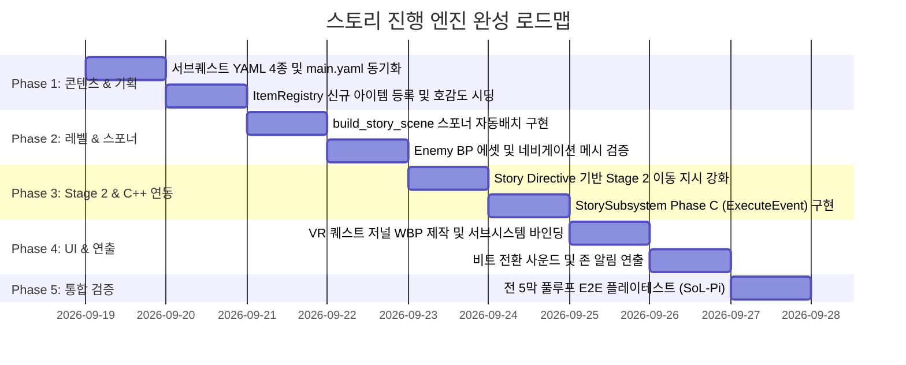

# SPEC: Story Progression Engine & Development Roadmap
## 스토리 진행을 위한 종합 요소 분석 및 단계별 개발 로드맵

> **문서 상태**: 확정 (2026-09-18)  
> **적용 대상**: `feature/story-director` 브랜치  
> **참조 문서**: `docs/STORY_SCENARIO.md`, `docs/SPEC_story_director.md`, `AGENTS.md`  
> **핵심 원칙**: 
> 1. 결정론적 상태 머신(`app/story`)이 뼈대를 잡고, LLM(디렉터 및 Stage 2 플래너)은 동적 연출과 행동 계획을 담당한다.
> 2. Elara를 비롯한 주역 NPC는 레벨 시작 시 우리에 정적으로 감금하지 않고, **Story Directive와 Stage 2 플래너를 통해 시나리오 전개에 맞춰 동적으로 이동 및 상태를 제어**한다.
> 3. 필드 몬스터는 LLM 토큰을 쓰지 않는 경량 C++ 액터(`AEnemyCharacter`, `AEnemySpawner`)를 활용해 VR 90Hz 퍼포먼스를 엄격히 보장한다.

---

## 1. 시스템 아키텍처 개요 (System Architecture)

스토리 진행 시스템은 **[상태 판정 계층] - [인지 오케스트레이션 계층] - [VR 물리 및 게임플레이 계층]**의 3계층 하이브리드 구조로 동작합니다.

```mermaid
flowchart TD
    subgraph Layer1["1. 결정론적 상태 판정 계층 (Python app/story)"]
        SM["StoryMachine (state.py)<br>비트 전이 / 서브퀘스트 상태 머신"]
        CW["CompleteWhen 평가기<br>(talked_to, boss_killed, flag)"]
        FILE["story_state.json<br>(원자적 파일 저장/복원)"]
        SM <--> CW
        SM <--> FILE
    end

    subgraph Layer2["2. 인지 오케스트레이션 계층 (Python CognitiveEngine)"]
        DIR["Story Director (director.py)<br>gemma4:cloud (31B)<br>비트 각색 & NPC Goal / 퀘스트 로그 생성"]
        S2["Stage 2 플래너 (planner.py)<br>STORY DIRECTIVE 수신<br>NPC 이동/동선/행동 멀티턴 계획(steps)"]
        S1["Stage 1 대사 모델 (dialogue.py)<br>캐릭터 페르소나 대사 & 즉시 액션"]
        DIR --> S2 --> S1
    end

    subgraph Layer3["3. VR 게임플레이 & 실행 계층 (UE5 Client)"]
        NMS["UNPCManager (WebSocket 송수신)"]
        SS["UStorySubsystem<br>FStoryState 브로드캐스트 / 이벤트 실행"]
        SZT["AStoryZoneTrigger (9개 구역 감지)"]
        ESP["AEnemySpawner / AEnemyCharacter<br>(필드 토벌 몬스터)"]
        NPC["BP_SmartNPC (Elara, Moca, Skadi...)<br>StateTree / 액티브 래그돌 / 이동"]
        UI["WBP_QuestLog (VR 퀘스트 HUD)"]
        
        NMS <--> SS
        SS --> UI
        SS --> NPC
        SZT --> NMS
        ESP --> NMS
    end

    CW -.->|트리거 평가| SM
    SM -->|비트 전이 시| DIR
    NMS <==>|MessageEnvelope (JSON)| SM
```

---

## 2. 현황 진단 및 갭 분석 (Gap Analysis - 파일 단위 실측)

코드베이스 전수 조사를 통해 파악된 현재 구현 상태와 스토리 완성을 위해 필요한 작업 목록입니다.

| 영역 | 핵심 파일 | 현재 구현 상태 | 추가/보완이 필요한 요소 (Gaps) |
| :--- | :--- | :--- | :--- |
| **시나리오 데이터** | `app/story/content/main.yaml`<br>`app/story/content/side/*.yaml` | • 메인 5막 7비트 초안 작성됨.<br>• `s_moca_herbs.yaml` 1종만 존재. | • 서브퀘스트 YAML 3종 미작성 (`s_hunt_forest_raiders`, `s_hunt_bridge_troll`, `s_hunt_dead_wraith`).<br>• `main.yaml`에 서브퀘스트 해금(`unlocks_side`) 3종 누락 반영. |
| **상태 머신 (Python)** | `app/story/loader.py`<br>`app/story/state.py`<br>`app/story/director.py` | • YAML 스키마 검증 완비.<br>• `talked_to`, `boss_killed`, `flag` 전이 완비.<br>• 디렉터 LLM 각색 및 폴백 완비. | • 서브퀘스트 완료를 위한 플래그 네이밍 표준화 (`flag:<quest_id>_cleared`, `item_acquired:*`, `zone_enter:*`). |
| **Stage 2 플래너 연동** | `app/agents/subgraphs/dialogue.py`<br>`app/agents/subgraphs/prompts.py` | • `=== STORY DIRECTIVE ===` 블록 주입 완비.<br>• Stage 2 `PlanBatchResponse` 완비. | • Stage 2 플래너가 NPC의 동적 위치 이동(Move/Teleport) 지시를 명확히 이해하도록 프롬프트 가이드 보강.<br>• Elara 전초기지 납치/구출 비트별 디렉티브 템플릿 정립. |
| **적/몬스터 시스템** | `Source/.../Enemy/EnemySpawner.h/.cpp`<br>`Source/.../Enemy/EnemyCharacter.h/.cpp` | • C++ 경량 몬스터 클래스 구현 완료.<br>• 처치 수량 카운팅 및 플래그 송신 완료.<br>• 네임드 사망 시 `npc_died` 송신 완료. | • `tools/build_story_scene.py`에 스포너 배치 함수(`build_enemies`) 누락.<br>• 몬스터 BP 에셋(`BP_Enemy_Bandit`, `BP_Enemy_Orc`, `BP_Enemy_Wraith`) 확인 및 연결 필요. |
| **구역 트리거** | `Source/.../Story/StoryZoneTrigger.h/.cpp`<br>`Content/Level/Sample.umap` | • `AStoryZoneTrigger` C++ 구현 완료.<br>• 맵 상에 9개 구역 트리거 액터 배치 완료. | • 비트 시트의 `complete_when: {type: flag, name: "zone_enter:<Zone>"}`와의 키 일치 검증. |
| **아이템 & 루팅** | `Content/Data/Items/ItemRegistry.csv`<br>`Source/.../Inventory/InventoryComponent.cpp` | • 아이템 73종 등록 완료.<br>• 아이템 획득 시 `item_acquired:<ItemID>` 이벤트 자동 송신 구현 완료. | • 성검 파편(`BrokenSword_Piece_01~03`), 몬스터 전리품(`VagronHorn` 등) 레지스트리 추가.<br>• 레벨 내 파편 오브젝트 배치. |
| **UE5 스토리 런타임** | `Source/.../Story/StorySubsystem.h/.cpp` | • `ApplyStoryJson` 파싱 완료.<br>• `OnStoryUpdated` 브로드캐스트 완료. | • `Story.events` 파싱 및 실행기(`ExecuteEvent`: `spawn_enemy`, `move_npc`, `play_sound`) 구현 (Phase C). |
| **UI & 피드백** | `Content/UI/` | • 없음. | • `UStorySubsystem`과 바인딩되는 VR 퀘스트 저널 위젯(`WBP_QuestLog`) 제작 (Phase B). |

---

## 3. 핵심 요소별 상세 개발 명세 (Detailed Specifications)

### 3.1 스토리 콘텐츠 & 비트 시트 정비 (`content/`)

#### [메인 비트 시트: `content/main.yaml`]
5막 7비트의 전이 조건과 서브퀘스트 해금을 엄격히 동기화합니다:
- `b1_kingdom_fall` (성문 피신): `complete_when: {type: talked_to, npc_id: Guard, min_turns: 1}` -> 해금: `s_hunt_forest_raiders`
- `b2_james_order` (도적의 오더): `complete_when: {type: talked_to, npc_id: James, min_turns: 2}` -> 해금: `s_moca_herbs`
- `b3_recruit_party` (마법사와 거너): `complete_when: {type: talked_to, npc_id: Moca, min_turns: 2}` -> 해금: `s_hunt_bridge_troll`
- `b4_reforge_and_elara` (기사단장 구출): `complete_when: {type: boss_killed, boss_id: Commander_Vorg}` -> 해금: `s_hunt_dead_wraith`
- `b5_moca_betrayal` (Moca의 배신): `complete_when: {type: talked_to, npc_id: James, min_turns: 2}`
- `b6_save_moca_and_boss` (마왕성 결전): `complete_when: {type: boss_killed, boss_id: DemonLord}`
- `b7_epilogue` (새로운 여정): `complete_when: {type: talked_to, npc_id: Elara, min_turns: 1}` -> 종착(`end`)

#### [서브퀘스트 YAML 4종 규격 (`content/side/*.yaml`)]
C++ `AEnemySpawner`와 `InventoryComponent`의 송신 규약에 맞춰 `complete_when`을 설계합니다:

1. **`s_hunt_forest_raiders.yaml`** (숲의 약탈자 척살령):
   - 해금: `b1_kingdom_fall`
   - 의뢰주: `Guard`
   - 완료 조건: `{type: flag, name: "flag_forest_raiders_cleared"}` (스포너가 도적 3명 누적 처치 시 송신)
2. **`s_moca_herbs.yaml`** (마법사의 약초 바구니):
   - 해금: `b2_james_order`
   - 의뢰주: `Moca`
   - 완료 조건: `{type: flag, name: "item_acquired:HerbBasket"}` (플레이어가 숲 빈터에서 약초 바구니 루팅 시 송신)
3. **`s_hunt_bridge_troll.yaml`** (다리의 도살자 바그론):
   - 해금: `b3_recruit_party`
   - 의뢰주: `James`
   - 완료 조건: `{type: boss_killed, boss_id: "Orc_Vagron"}` (네임드 오크 사망 시 `npc_died` 이벤트 송신)
4. **`s_hunt_dead_wraith.yaml`** (죽은 숲의 원혼 정화):
   - 해금: `b4_reforge_and_elara`
   - 의뢰주: `Elara`
   - 완료 조건: `{type: flag, name: "flag_dead_wraiths_cleared"}` (스포너가 망령 4체 누적 처치 시 송신)

---

### 3.2 Stage 2 플래너 기반 동적 위치 & 행동 제어

> [!IMPORTANT]
> **사용자 피드백 반영 핵심 원칙**: Elara는 레벨 시작 시 전초기지 우리에 정적으로 배치되지 않습니다. Stage 2 모델이 비트 지시(Story Directive)를 받아 상황에 맞춰 거점을 이동하거나 상태를 전환합니다.

#### 1. 비트 전개에 따른 Elara의 동적 상태 천이표
| 메인 비트 | Elara의 위치 및 역할 | Story Directive (디렉터 주입) | Stage 2 플래너 목표 행동 (`steps`) |
| :--- | :--- | :--- | :--- |
| **`b1 ~ b3`** | 왕국 잔해 / 비밀 은신처 (`hideout`) | "성에서 탈출한 생존자들을 수습하며 마왕군 정찰을 준비한다" | 1. 피난민 보호 및 주변 경계<br>2. 플레이어 조우 시 격려 및 성검 조각 탐색 당부 |
| **`b4` 진입 시** | 마왕군 전초기지 감옥 (`outpost_cage`) | "전초기지 기습 중 Vorg의 함정에 걸려 포로 우리에 감금됨" | 1. 전초기지 우리 위치로 이동/배치 (`Move/Teleport`)<br>2. 포로 대기 및 구조 요청 (`Wait/Pain`) |
| **`b4` 완료 후** | 전초기지 앞마당 -> 성검 제단 (`plaza`) | "구출됨. 플레이어에게 감사하며 성검 1차 복원을 위해 제단으로 이동" | 1. 우리 탈출 및 플레이어 감사 대화 (`Dialogue`)<br>2. 광장 제단으로 이동 (`Move: plaza`) |
| **`b5` (위기)** | 광장 제단 | "Moca의 배신에 충격받았으나 플레이어에게 검 대신 기사의 의지를 강조" | 1. 절망한 플레이어 위로 및 격려 (`Dialogue`)<br>2. 마왕성 침투 장비 점검 (`Equip`) |
| **`b6 ~ b7`** | 마왕성 입구 (`citadel`) -> 귀환 | "마왕군 친위대를 막아서며 플레이어의 최종 결전 지원" | 1. 마왕성 돌입 및 엄호 (`Attack/Combat`)<br>2. 결전 승리 후 성문으로 개선 행진 (`Move: gate`) |

#### 2. Stage 2 플래너 프롬프트 강화
`OmniAgent_VR_System/CognitiveEngine/app/agents/subgraphs/prompts.py`의 `PLAN_SYSTEM_PROMPT`에 공간 이동 및 연출 지시 가이드를 명시합니다:
- `STORY DIRECTIVE`에 특정 거점(예: `OutpostCage`, `Plaza`, `Hideout`)이나 포로/합류 상황이 명시되면, Stage 2는 첫 번째 step으로 해당 거점으로의 이동(`MoveTo Location`) 또는 태세 전환을 최우선 스텝으로 배치합니다.

---

### 3.3 필드 몬스터 & 스포너 파이프라인 (UE5 C++)

VR 환경에서 드로우콜과 SkeletalMesh 애니메이션, Chaos 물리 연산의 병목을 방지하기 위해 **LLM 비연동형 경량 C++ 액터**를 배치합니다.

```
                  ┌────────────────────────────────────────┐
                  │            AEnemySpawner               │
                  │  - SpawnInterval: 15s                  │
                  │  - MaxAlive: 3                         │
                  │  - KillsForFlag: 3                     │
                  │  - KillFlag: "flag_forest_raiders_..." │
                  └──────────────────┬─────────────────────┘
                                     │ SpawnOne()
                                     ▼
                  ┌────────────────────────────────────────┐
                  │            AEnemyCharacter             │
                  │  - Base: ACombatCharacter (물리 타격)   │
                  │  - AI: AEnemyAIController (배회/추적)   │
                  │  - Ragdoll: UNPCRagdollComponent      │
                  │  - StimuliSource: 아군 NPC 시야 감지    │
                  └──────────────────┬─────────────────────┘
                                     │ OnDeath (누적 3킬 달성)
                                     ▼
                  ┌────────────────────────────────────────┐
                  │   UNPCManager::SendStoryEvent(...)     │
                  │   -> Python StoryMachine Flag 달성!    │
                  └────────────────────────────────────────┘
```

#### 1. 구역별 스포너 배치 파라미터 (`tools/build_story_scene.py::build_enemies`)
`build_story_scene.py`에 `build_enemies()`를 추가하여 씬 재생성 시 자동 배치합니다:
1. **숲 도적단 스포너 (`SCN_spawner_forest_bandits`)**:
   - 위치: `(7500, -7500, ground_z)` (FOREST 남쪽 외곽)
   - 클래스: `BP_Enemy_Bandit` (체력 50, 단검)
   - `MaxAlive`: 3, `KillsForFlag`: 3, `KillFlag`: `"flag_forest_raiders_cleared"`
2. **다리 오크 바그론 스포너 (`SCN_spawner_bridge_troll`)**:
   - 위치: `(13800, -1800, ground_z)` (BRIDGE 강 다리 교각 하부)
   - 클래스: `BP_Enemy_OrcVagron` (미니보스, 체력 180, 대형 둔기, 네임드 `EnemyID="Orc_Vagron"`)
   - `MaxAlive`: 1, `TotalSpawnLimit`: 1 (사망 시 자체 `npc_died` 이벤트로 보스킬 판정)
3. **죽은 숲 망령 스포너 (`SCN_spawner_dead_wraiths`)**:
   - 위치: `(10500, 16500, ground_z)` (DEAD FOREST 마왕성 앞 진입로)
   - 클래스: `BP_Enemy_Wraith` (체력 80, 암흑 이펙트)
   - `MaxAlive`: 2, `KillsForFlag`: 4, `KillFlag`: `"flag_dead_wraiths_cleared"`

---

### 3.4 아이템 및 루팅 파이프라인

1. **`Content/Data/Items/ItemRegistry.csv` 신규 아이템 등록**:
   - `BrokenSword_Piece_01` (성검의 칼끝 - 숲 폭격지 루팅)
   - `BrokenSword_Piece_02` (성검의 가드 - 오크 바그론 처치 루팅)
   - `BrokenSword_Piece_03` (성검의 폼멜 - 도서관 폐허 루팅)
   - `VagronHorn` (바그론의 부러진 뿔 - 서브퀘스트 증표)
   - `GhostEssence` (사령의 정수 - 서브퀘스트 증표)
2. **루팅 시 이벤트 송신 흐름**:
   - 플레이어가 월드 액터(아이템)와 오버랩 또는 VR 컨트롤러로 그립/습득.
   - `UInventoryComponent::AddItem` 실행.
   - `Manager->SendStoryEvent(TEXT("item_acquired"), ItemData.ItemID)` 발송.
   - Python `_handle_story_event`가 `"item_acquired:<ItemID>"` 플래그를 세팅하여 퀘스트 조건 즉시 만족.

---

### 3.5 UE5 런타임 스토리 서브시스템 확장 (Phase B & C)

#### 1. Phase C: 세계 변화 이벤트 실행기 (`UStorySubsystem::ExecuteEvent`)
디렉터 응답의 `Story.events[]`를 수신하여 C++에서 안전하게 실행하는 화이트리스트 디스패처를 구축합니다.
- `cmd: "move_npc"`:
  - 파라미터: `npc_id`, `loc` (좌표 문자열 또는 태그된 앵커 액터 이름)
  - 실행: 해당 `BP_SmartNPC` 액터를 찾아 `AIController::MoveToLocation` 또는 텔레포트 수행.
- `cmd: "spawn_enemy"`:
  - 파라미터: `enemy_id`, `loc`, `count`
  - 실행: 지정 위치에 해당 적 클래스 스폰.
- `cmd: "play_announcement"`:
  - 파라미터: `sound_id`, `text`
  - 실행: VR 공간 오디오 재생 및 화면 자막 노출.

#### 2. Phase B: VR 퀘스트 저널 위젯 (`WBP_QuestLog`)
- `UStorySubsystem::OnStoryUpdated` 델리게이트에 바인딩.
- VR 플레이어의 왼손 손목 또는 메뉴 호출 시 HUD로 표시:
  - **메인 퀘스트**: 비트 타이틀 및 `CurrentState.QuestLog` (1문장 목표)
  - **서브퀘스트 목록**: `CurrentState.Side` 배열에 담긴 active 퀘스트 타이틀 및 진행 상태

---

## 4. 단계별 개발 로드맵 (Phased Development Roadmap)



### [Phase 1: 데이터 & 기획 동기화] (예상: 1일)
- **목표**: 모든 비트와 서브퀘스트가 스키마 에러 없이 Python 인지 서버에 로드되는 상태 달성.
- **작업 파일**:
  - `app/story/content/main.yaml`: 5막 7비트 완료 조건 및 unlocks_side 동기화.
  - `app/story/content/side/`: 4종 YAML 생성 (`s_hunt_forest_raiders`, `s_moca_herbs`, `s_hunt_bridge_troll`, `s_hunt_dead_wraith`).
  - `app/story/seed.py`: 적대 그룹 호감도 세팅 (`HOSTILES` 배열 정리, Elara 하드코딩 제거).
  - `Content/Data/Items/ItemRegistry.csv`: 성검 파편 및 전리품 아이템 행 추가.

### [Phase 2: 레벨 스포너 & 몬스터 배치] (예상: 1일)
- **목표**: 500m×500m 레벨에서 퀘스트 타겟 몬스터가 정상 스폰되고 처치 시 플래그가 전송되는 환경 구축.
- **작업 파일**:
  - `tools/build_story_scene.py`: `build_enemies()` 함수 추가 (숲/다리/죽은숲 스포너 멱등 생성).
  - `Content/Blueprint/Enemy/`: `BP_Enemy_Bandit`, `BP_Enemy_OrcVagron`, `BP_Enemy_Wraith` 에셋 설정 점검.
  - RecastNavMesh 빌드 및 스폰 포인트 유효성 검증.

### [Phase 3: Stage 2 동적 연출 & UE5 이벤트 실행기] (예상: 1.5일)
- **목표**: Elara 등 NPC가 비트에 맞춰 거점을 유연하게 이동하고, 서버가 UE5에 직접 세계 조작 명령을 내릴 수 있는 파이프라인 완성.
- **작업 파일**:
  - `app/agents/subgraphs/prompts.py`: Stage 2 플래너 프롬프트에 비트별 동적 위치 이동 가이드 추가.
  - `Source/UE5_MCP_VR/Story/StorySubsystem.h/.cpp`:
    - `ExecuteEvent(const FJsonObject& EventObj)` 구현 (`move_npc`, `spawn_enemy`).
    - `ApplyStoryJson`에서 `events` 배열을 파싱해 순차 디스패치.

### [Phase 4: VR UI & 플레이어 피드백] (예상: 1일)
> **완료(2026-09-21)** — 퀘스트 텍스트는 `WBP_PlayerHUD` 의 `QuestLogText`(2026-09-18)로 대체 구현.
> SFX/햅틱은 `UPlayerHUDWidget::HandleStoryUpdated`(`RefreshQuestLogText` 와 분리해 초기 리플레이 시
> 오작동 방지)에서 `QuestUpdateSound`/`QuestUpdateHaptic` 재생 — 둘 다 EditDefaultsOnly, 미배정이면 스킵.
- **목표**: 플레이어가 VR 헤드셋 안에서 현재 진행해야 할 스토리와 서브 목표를 명확히 인지.
- **작업 파일**:
  - `Content/UI/WBP_QuestLog.uasset`: `UStorySubsystem::OnStoryUpdated`를 바인딩하여 퀘스트 텍스트 표시.
  - 퀘스트 갱신/완료 시 효과음(SFX) 및 햅틱 피드백 트리거.

### [Phase 5: 통합 검증 (End-to-End Test)] (예상: 0.5일)
- **검증 시나리오**:
  1. 성문 도착 (`b1`) -> Guard 대화 -> `s_hunt_forest_raiders` 해금 확인.
  2. 숲 외곽 이동 -> 도적 3명 처치 -> 스포너 플래그 송신 -> 서브퀘스트 1 완료 확인.
  3. James 조언 (`b2`) -> Moca 약초 의뢰 (`s_moca_herbs`) 수락 -> 숲 빈터 약초 바구니 루팅 -> 서브 2 완료.
  4. 동료 합류 (`b3`) -> 다리 밑 오크 바그론 토벌 (`s_hunt_bridge_troll`) -> 네임드 킬 완료.
  5. 전초기지 돌입 (`b4`) -> Elara 우리 감금 상태 확인 -> Vorg 보스 처치 -> Elara 구출 및 합류.
  6. Moca 배신 이벤트 (`b5`) -> 마왕성 진입로 죽은 숲 망령 정화 (`s_hunt_dead_wraith`) -> 성검 각성 및 DemonLord 처치 (`b6`) -> 에필로그 (`b7`).

---

## 5. VR 성능 및 안전성 가이드라인 (Performance Guardrails)

1. **VR 90Hz 프레임 예산 보호 (DrawCall & SkeletalMesh)**:
   - 필드 몬스터는 동시 생존 상한(`MaxAlive`)을 철저히 2~3마리로 제한한다.
   - 플레이어와 40m 이상 떨어진 스포너는 스폰 주기를 일시 정지(Sleep)하여 백그라운드 AI 틱 낭비를 원천 차단한다.
2. **액티브 래그돌 물리 안정성**:
   - `AEnemyCharacter` 사망 시 래그돌 전환 후 5초(`CorpseLifetime`) 뒤 안전하게 소멸(Destroy)시켜 Chaos 물리 엔진의 누적 오브젝트 부하를 방지한다.
3. **비트 전이 데드락 방지**:
   - 모든 대화 비트(`talked_to`)는 `min_turns`를 1~2턴으로 짧게 설정하여 LLM 응답 지연 시에도 플레이어가 빠르게 다음 단계로 넘어갈 수 있도록 배려한다.
   - 필수 플래그 누락 시에도 콘솔 명령 또는 디버그 트리거로 비트를 강제 전이할 수 있는 백도어(`StorySubsystem::ForceAdvanceBeat`)를 유지한다.

