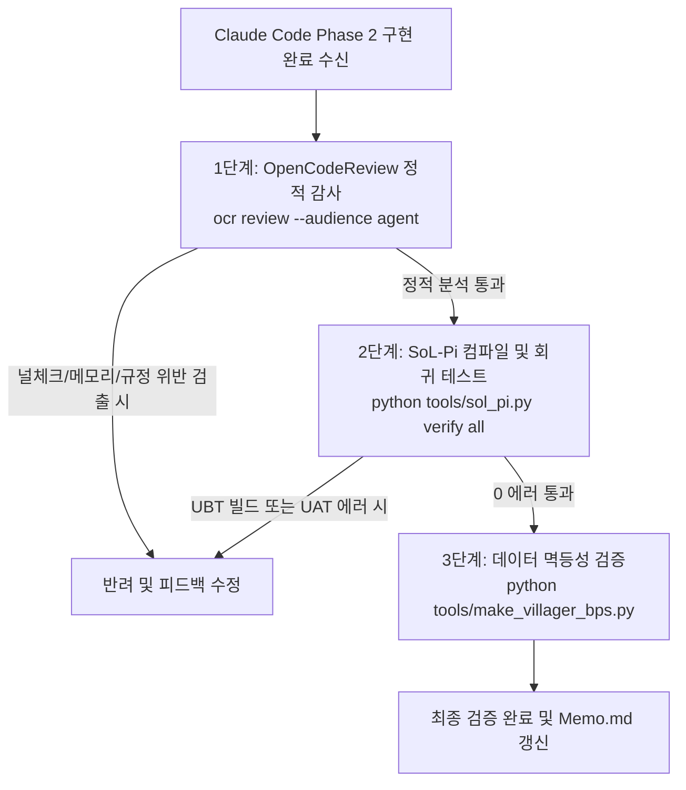

# SPEC_villager_npc Phase 2 완료 근거 및 검증 기준서 (Verification Plan)

> **문서 목적**: `SPEC_villager_npc.md` Phase 2 (입: 상호작용 및 로컬 키워드 길 안내) 구현에 대한 합격 판정 기준(Acceptance Criteria)과 물리적·정적 자동화 검증 절차 정의.  
> **책임 에이전트**: Gemini Master (검증관 & 아키텍트) / 실행 도구: OpenCodeReview(`ocr`) + SoL-Pi(`sol_pi.py verify all`)

---

## 1. 완료 판정 근거 (Acceptance Criteria)

| ID | 검증 항목 | 합격 판정 기준 (Acceptance Criteria) | 검증 대상 파일 |
| :--- | :--- | :--- | :--- |
| **AC-1** | **말풍선 UI 연동** | `AVillagerCharacter`에 `UNPCDialogueUIComponent`가 연동되어 대사가 말풍선 위젯에 표시되고, 발화자 이름으로 `VillagerID`가 정상 출력되는가? | `VillagerCharacter.{h,cpp}` |
| **AC-2** | **근접 E 상호작용** | `VRPawn::OnInteract` 호출 시, SmartNPC보다 주민이 더 가까우면 `AVillagerAIController`의 Greet 상태(플레이어 바라보기 + Wave 클립 + 고정 대사 1줄)가 발동되는가? | `VRPawn.cpp`, `VillagerAIController.cpp` |
| **AC-3** | **채팅 서버 미전송** | `VRPawn::SayToNpc` 시 최근접 폰이 주민이면 **WebSocket 서버 전송을 건너뛰고(0 Token)** 로컬 키워드 응답만 즉시 말풍선에 띄우는가? (SmartNPC가 더 가까우면 기존대로 서버 전송) | `VRPawn.cpp`, `PlayerInteractionUtils.cpp` |
| **AC-4** | **비트별 길 안내** | `StorySubsystem`의 `BeatId`를 읽어 '길', '어디', '퀘스트', '가야' 키워드 입력 시 현재 스토리 진행도에 맞는 목적지 안내문이 출력되는가? | `VillagerCharacter.cpp`, `StorySubsystem.h` |
| **AC-5** | **데이터 멱등성** | `tools/make_villager_bps.py` 실행 시 주민 4종(Townsfolk, Refugee, Scholar, Merchant)의 기본 대사 풀과 키워드 테이블이 BP 프로퍼티로 올바르게 주입되는가? | `tools/make_villager_bps.py` |

---

## 2. 자동화 검증 파이프라인 (Verification Pipeline)

Claude Code의 구현 완료 직후 순차적으로 실행할 검증 단계:

### 2.1 1단계: OpenCodeReview 정적 감사 (`ocr review`)
- **실행 명령**: `ocr review --audience agent`
- **검증 항목**:
  - `nullptr` 포인터 체크 누락 여부 (`VillagerCharacter`, `NPCDialogueUIComponent`, `StorySubsystem` 등)
  - `NPCActionComponent` 외 Blackboard 직접 쓰기 위반 여부 (RULE[ue5_cpp.md])
  - 불필요한 메모리 누수나 무한 루프 가능성

### 2.2 2단계: SoL-Pi 액션 퓨전 검증 (`sol_pi.py verify all`)
- **실행 명령**: `python tools/sol_pi.py verify all`
- **검증 항목**:
  1. **C++ UBT 증분 빌드**: 컴파일 오류 0건, UHT 리플렉션 무결성.
  2. **Python 인지 엔진 Pytest**: 51개 테스트 100% 통과 (기존 서버 로직 무영향 보장).
  3. **UE5 UAT 엔진 헤드리스 테스트**: 에디터 크래시 없이 `EXIT CODE: 0` 확인.

### 2.3 3단계: 대사 데이터 및 라우팅 무결성 확인
- `tools/make_villager_bps.py` 실행 결과 확인.
- Git Diff 검토로 `SayToNpc`에서 최근접 폰 판정 로직의 정확성 및 서버 차단 분기 확인.

