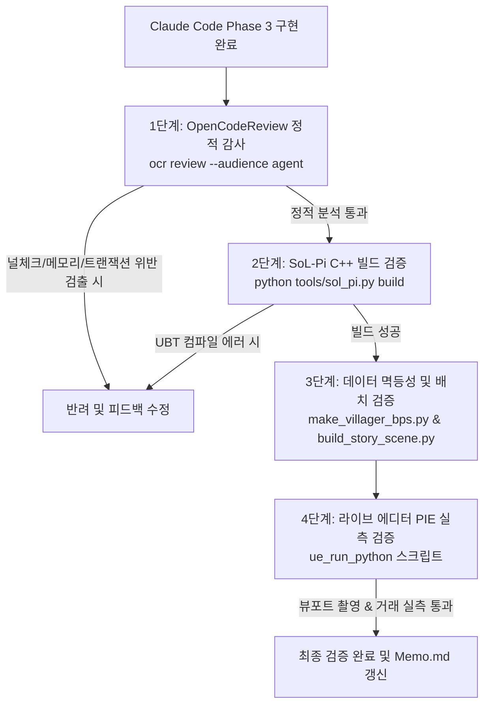

# SPEC_villager_npc Phase 3 완료 근거 및 검증 기준서 (Verification Plan)

> **문서 목적**: `SPEC_villager_npc.md` Phase 3 (상인 NPC: 골드 통화, 가판대 진열 실물 구매/판매, HUD 골드 표시) 구현에 대한 합격 판정 기준(Acceptance Criteria)과 물리적·정적 자동화 검증 절차 정의.  
> **책임 에이전트**: Gemini Master (총괄 기획 & 검증관) / 구현: Claude Code CLI / 검증 도구: OpenCodeReview(`ocr`) + SoL-Pi(`sol_pi.py verify`) + 에디터 MCP(`ue5`) 라이브 PIE

---

## 1. 완료 판정 근거 (Acceptance Criteria)

| ID | 검증 항목 | 합격 판정 기준 (Acceptance Criteria) | 검증 대상 파일 |
| :--- | :--- | :--- | :--- |
| **AC-1** | **골드 통화 시스템** | `UInventoryComponent`에 `int32 Gold`(기본 150)와 증감 함수(`AddGold`, `RemoveGold`, `CanAfford`) 및 `FOnGoldChanged` 델리게이트가 구현되어 있는가? (LLM 인벤토리 JSON 직렬화에 미포함되어 프롬프트 토큰 불변 유지) | `InventoryComponent.{h,cpp}` |
| **AC-2** | **HUD 골드 표시** | `UPlayerHUDWidget`에 `GoldText`(BindWidgetOptional)가 추가되고, `OnGoldChanged` 델리게이트와 연동되어 골드 증감 시 즉시 수치가 실시간 갱신되는가? | `PlayerHUDWidget.{h,cpp}`, `WBP_PlayerHUD` |
| **AC-3** | **가판대 진열 실물 상태** | `ADroppedItemBase`에 진열 플래그(`bIsDisplayed`), 소유 상인, 가격이 연동되어 진열 중에는 물리가 고정(`SetPhysicsFrozen(true)`)되고 E키 줍기(`TryPickupNearby`)로 공짜 획득이 차단되는가? 툴팁에 가격이 정상 출력되는가? | `DroppedItemBase.{h,cpp}`, `ItemTooltipWidget.{h,cpp}` |
| **AC-4** | **상인 가판대 & 매입 상자** | `AMerchantStall` 액터가 6개 슬롯에 상인 재고 실물을 스폰/진열하고, 슬롯 구매 시 다음 재고를 재진열하는가? 매입 상자 영역에서 매입가 `Max(1, BaseValue * 0.5)` 계산 및 `BaseValue == 0` 매입 거부가 올바르게 처리되는가? 진열품 꼼수 매입이 원천 차단되는가? | `MerchantStall.{h,cpp}`, `VillagerCharacter.{h,cpp}` |
| **AC-5** | **VR 그랩 구매/판매 트랜잭션** | `VRPawn` 그랩 시 진열품이면 `CanAddItem` 확인 → `Gold 차감` → `손에 쥐기` Transactional 순서가 보장되는가? 골드/가방 부족 시 거부 대사 및 손 미부착이 보장되는가? 그랩 해제 시 매입 상자 안이면 판매 처리되는가? (아이템 복사 버그 0건) | `VRPawn.cpp` |
| **AC-6** | **상인 BP 및 시장 배치** | `tools/make_villager_bps.py`로 `BP_Villager_Merchant`(재고 소모품 18개, 상인 대사)가 생성되고, `tools/build_story_scene.py`로 시장 가판대에 상인 + 가판대 액터가 정적 배치되는가? | `make_villager_bps.py`, `build_story_scene.py` |
| **AC-7** | **LLM NPC 주민 Perception 연동** | `AVillagerCharacter`가 `UAIPerceptionStimuliSourceComponent`를 등록하고, `ASmartNPC::PerceptionIdFor`가 `VillagerID`를 반환하여 SmartNPC가 주민을 언리얼 시스템 액터명이 아닌 고유 이름으로 인식하는가? | `VillagerCharacter.{h,cpp}`, `SmartNPC.cpp` |

---

## 2. 자동화 검증 파이프라인 (Verification Pipeline)

### 2.1 1단계: OpenCodeReview 정적 감사 (`ocr review`)
- **실행 명령**: `ocr review --audience agent`
- **중점 감사 항목**:
  - `CanAddItem` 확인 전 골드 차감 또는 아이템 전달 여부 (먹튀/증발 트랜잭션 버그 방지)
  - `bIsDisplayed` 아이템 매입 상자 오버랩 방어 여부
  - `nullptr` 안전성 (`MerchantStall`, `DisplayMerchant`, `Inventory` 등)
  - Blackboard 직접 쓰기 금지 규칙 및 네이밍 컨벤션 준수 여부

### 2.2 2단계: SoL-Pi 빌드 검증 (`sol_pi.py build`)
- **실행 명령**: `python tools/sol_pi.py build`
- **검증 항목**:
  - UHT 리플렉션 무결성 및 C++20 MSVC 컴파일 에러 0건.

### 2.3 3단계: BP 생성 및 시장 가판대 액터 배치
- `tools/make_villager_bps.py` 실행: `BP_Villager_Merchant` 정상 빌드 확인.
- `tools/build_story_scene.py` (`SCN_ONLY=villager`): 시장 가판대에 상인 + 가판대(`MerchantStall`) 100% 정상 배치 및 NavMesh 스냅 확인.

### 2.4 4단계: 라이브 PIE 실측 검증 (MCP `ue5`)
- VRPawn을 가판대 앞으로 이동(골드 150).
- 가판대 HealthPotion(60G) 그랩 구매 $\rightarrow$ 잔여 골드 90G 확인, 손에 쥠 확인, 슬롯에 다음 아이템 재진열 확인.
- 3번째 구매 시도(잔여 30G) $\rightarrow$ 골드 부족 거부, 상인 말풍선 대사 출력, 아이템 물리 유지 확인.
- 소지 아이템 매입 상자에 드랍 $\rightarrow$ 판매 골드 가산 및 실물 소멸 확인.
- BaseValue 0(퀘스트품) 매입 시도 $\rightarrow$ 매입 거부 대사 확인.
- 복사/증발 버그 0건 확인 및 뷰포트 스크린샷 캡처 증명.
